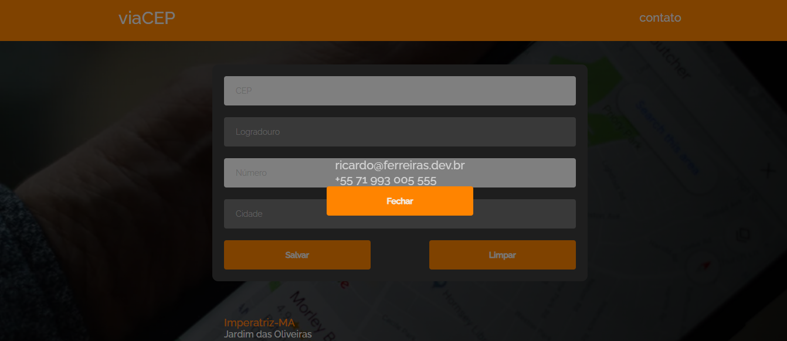

# viaCEP - Find your detailed address
This is an app that allows you to get a detailed address information given a valid CEP code,
(Valid only in Brazil), available at [https://notas.ferreiras.dev.br]. The goal here is to pratice even with a small appyou can take advantage of a design pattern approach including services, models and controllers, a 'mvc-like' approach for a single page app, influenced by @devsuperior 
and its approach on how to design
and develop software in a systemic and design pattern approach.
## _Table of contents_
- [Overview](#overview)
- [Screenshot](#screenshot)
- [Links](#links)
- [Built with](#built-with)
- [What I learned](#what-i-learned)
- [Continued development](#continued-development)
- [Resources](#useful-resources)
- [Author](#author)
- [Acknowledgments](#acknowledgments)
## _Overview_
The design is structured as shown:
 app|
    css|
        button.css
        modal.css
        stye.css
    js|
        controllers|
            form-controller.js
            list-controller.js
            modal-controller.js
            page-controller.js
        models|
            address.js
        services|
                exceptions|
                    request-exceptions
                address-service.js
                request-service.js

## _Screenshot_
[](https://notas.ferreiras.dev.br)
## _Links_
- Live Site URL: [https://notas.ferreiras.dev.br] 
## _Built with_
- Semantic HTML5 markup 
- CSS custom properties 
- Flexbox 
- CSS Grid 
- Mobile 
- first workflow 
- Vanilla Javascript 
 ## _What I praticed_
```html
<div class="form-control">
    <label for="number">Número</label>
    <input type="text" name="number" id="number" class="form-input" placeholder="Número">
    <div class="error-message" data-error="number"></div>
</div>
``` 
```css
 :root {
    --main-white: #f0f0f0;
    --main-red: #be3144;
    --main-blue: #45567d;
    --main-gray: #303841;
    --main-orange: #FF8400;
    --main-card: #3d3d3d;
    --orangered: rgb(255, 69, 0);
    --background-hr: #ebb653;
    --error-message: #faa;
}
``` 
```js
function State() {
  this.address = new Address();
  this.btnSave = null;
  this.btnClear = null;
  this.inputCep = null;
  this.inputStreet = null;
  this.inputNumber = null;
  this.inputCity = null;
  this.errorCep = null;
  this.errorNumber = null;
}
const state = new State();
``` 
## _Continued development_
- Next step: To clone this project and use ReactJS 
### _Useful resources_
- [https://developer.mozilla.org/pt-BR/docs/Web/JavaScript/Guide/Working_with_objects] Everything is an Object in JS.
- [https://html-css-js.com/] Mandatory pit stop at this site.
## _Author_
- Website - [https://ferreiras.dev.br] 
## Acknowledgments
- @devsuperior